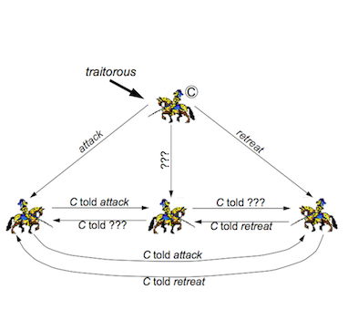

# TDDD25 anteckningar

## Transparens

Saker som är transparenta för användaren - alltså ej visas utan hanteras av det distribuerade systemet internt.

- Access transparency - lokala och externa resurser accessas på samma vis. 
- Location transparency - Användare kan ej se var mjuk- och hårdvaruresurser befinner sig. En resurs namn ska ej påvisa detta för att en applikation ska vara distribuerad. 
- Migration transparency - En användare kan röra sig från ett ställe till ett annat utan att applikationen ser dem som en ny instans/användare/namn
- Replicaiton transparency - systemet kan göra flera avbilder av data utan att användaren är medveten om detta (i syfte att skala prestanda och eller tillförlitlighet)
- Concurrency transparency - Användare märker ej av andra användare i systemet - även om man accessar samma resurs. 
- Failure transparancy - Applikationen ska upptäcka och hantera sina egna fel utan att meddela användaren.
- Performance transparancy - Variationer i last ska ej leda till märkbar prestandaförsämring. 

----------------

## Arkitekturmodeller

- Client-server
- Peer-to-peer

**Client-server**

Fördelar:

- Centralisering av tjänsten. Ger en enklare managerbar struktur än peer-to-peer

Nackdelar:

- Känsliga utifall en eller flera servrar går ned. Dessa ÄR applikationen så att säga. 
- Skalar sämre än peer-to-peer då applikationslasten inte fördelas över lika många noder.

**Peer-to-peer**

Fördelar:

- Skalar väldigt bra med många användare då varje individuell användare ökar kapaciteten i systemet. 
- Ger otrolig redundans då många noder kan leverera samma data. 

Nackdelar: 

- Hög komplexitet

### Olika varianter av de två:

- Proxy server
- Mobile Code
- Mobile Agents
- Network Computers
- Thin Clients
- Mobile Devices

----------------

## Interaktionsmodeller

### Synkrona och asynkrona system

**Synkrona system**

Funktioner:

- Exekveringstid sker inom givna tidsramar
- Mottagande av meddelanden sker inom given tidsram
- Man känner av maximal tidsskillnad mellan två lokala klockor inom systemet

Konsekvenser:

- Man använder en, för systemet, globalt uppfattad tid (med precision kopplad till max tillåten/möjlig avdrift)
- Endast synkrona system kan användas för real-time-applikationer
- Man kan använda timeouts för att upptäcka fel i kommunikationslänkar eller processer. 

Nackdel: 

- Det är otroligt svårt och kostsamt att implementera synkrona distribuerade system - de flesta systemen är asynkrona. 

**Asynkrona system**

Många distribuerade systemen är asynkrona. Detta innebär:

- Ingen gräns för övre och undre exekveringstid.
- Ingen övre gräns för meddelande-delay.
- Ingen gräns för avdrift mellan logiska klockor.

Konsekvenser:

- Det finns ingen, för systemet, global tid. All tidberäkning sker med hjälp av logiska klockor. 
- Dessa system är ej förutsägbara när det kommer till timing. 
- Timeouts kan ej användas.

I praktiken används timeouts för asynkrona system - men man behöver ta till fler verktyg för att garantera consistent state (ej ha duplikerade meddelanden, duplikerad exekvering av samma operationer etc). 

----------------

## Felmodeller

Typer av fel: 

- Omission faults - Då en process misslyckas med sin uppgift. Exempelvis att ngt går fel men att ändå svara på ett korrekt sätt. 
- Arbitrary faults - När en delkomponent lämnar ett felaktigt svar eller inte svarar alls. 
- Timing faults - När en delkomponent svarar utanför givna tidsramar.

----------------

## Begreppet tid och vektorklockor i dist system

- Totally ordered (fullständig ordning)
- Causally ordered (kausalt ordnat system)

### Kausalt

Garanterar olika händelsers relation till varandra - dock ej att de sker i exakt ordning tidsmässigt. Använder oftast vektorklockor (flerdimensionella Lamportklockor!)

### Total

Kan utföras m h a en centraliserad klocka/räknare, alternativt via distribuerad överenskommelse. Garanterar inte kausalitet (att event händer i rätt ordning). 

#### Distribuerad överenskommelse

En replica manager (RM) nummrerar sina requests enligt: 

**cuid(RMi,r) = max(SEENi,ACCEPTi) + 1 + i/N**

En front end (FE) får sedan requests från alla RMs och numrerar dessa enligt: 

**uid(r) = maxi∈{1 ...N}(cuid(RMi,r))**

### Tidsdrift och synkronisering av klockor

- NTP

Man kan aldrig ställa bak en klocka - bara sakta ner den.

**Algoritmer**

- Christians algorithm
- Berkely algorithm
- Distributed clocks synchronization algorithm

### Christian's algorithm

Sätt tiden genom tt beräkna:

**TmaxRec - TminRec = (T1 - T0) - 2tmin** *± (T1 - T0)/2 - tmin*

----------------

## Mutual exclusion

**Utan token**

- Central coordinator algorithm
- Ricart-Agrawala algorithm

**Med token**

- Ricart-Agrawala *second* algorithm
- Token ring algorithm

----------------

## Felhantering och feltolerans

### Forward vs backward recovery

Bakåt - spara tillstånd och återgå till detta.
Framåt - hårdavaru eller mjukvaruredundsns.

### Byzantinsk felmodell

För att åstadkomma distribuerad överenskommelse med k-redundans (k st felaktiga enheter) krävs 3k+1 enheter. 

### Omröstningar

r = nr samtidiga som säger läs  
w = nr samtidiga som säger write  
n = antal totala noder

För att undvika två samtidiga skrivningar -> **w > n/2**  
För att se till att alla som läser får senaste kopian -> **r + w > n** 

**Vid läsning**
  
- Lås "r" kopior.
- Välj den med högst versionsnummer.
- Läs vald kopia. 

**Vid skrivning**

- Lås w kopior
- Välj den med högst versionsnummer
- Skriv till denna (om ex x = x+1 behöver detta göras)
- Skriv vald version till alla w kopior

System med lågt r -> snabba läsningar  
System med högre r -> snabba skrivningar

På så sätt kan man anpassa systemet efter last.

----------------

## Middleware

**Object adapter**

Objektadaptern är det primära interfacet mellan serverobjektet och ORB. Denna håller koll på referensräkning och livstid för objekt och dess referenser. Objektens referenser genereras utifrån specifikationen av **Interface Definition Language** som skapas av programmeraren. 

### Interface Definition Language (IDL)

Ett interface som specificerar API:t som klienter kan använda för att utföra operationer på/med hjälp av objekt.

### Remote method invocation 

#### Statisk invokering

Statisk invokering är då mjukvaran vid kompileringstillfället är medveten om vilka interface servern exponerar. Detta ger ett litet overhead. 

#### Dynamisk invokering

Dynamisk invokering sker då klienten vid kompileringstillfället ej vet om vilka interface servern exponerar. Detta ger ett stort overhead då eventuella metoder som kallas vid run-time först måste traversera till servern och sedan ge en respons till klienten. 